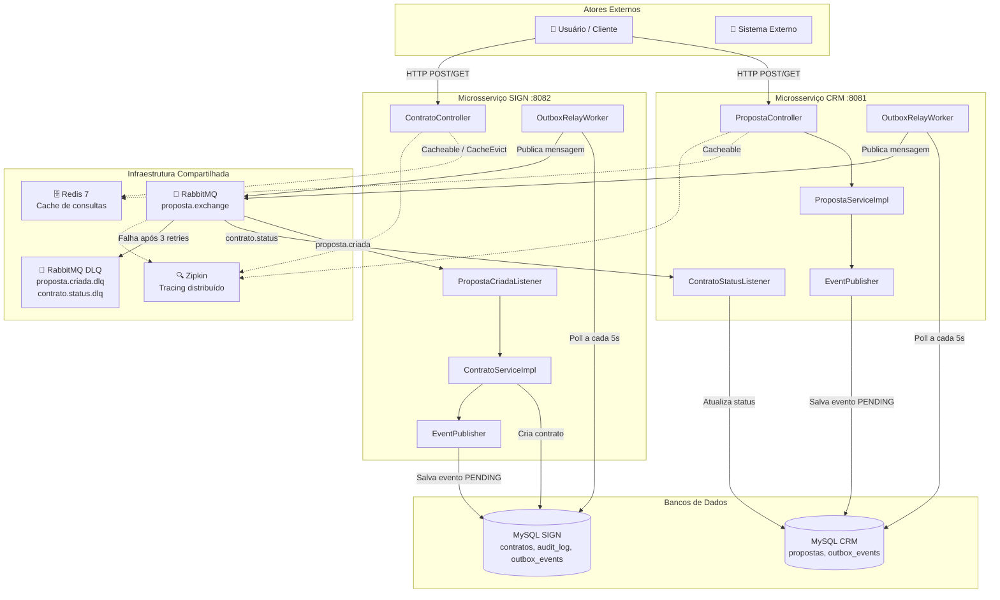
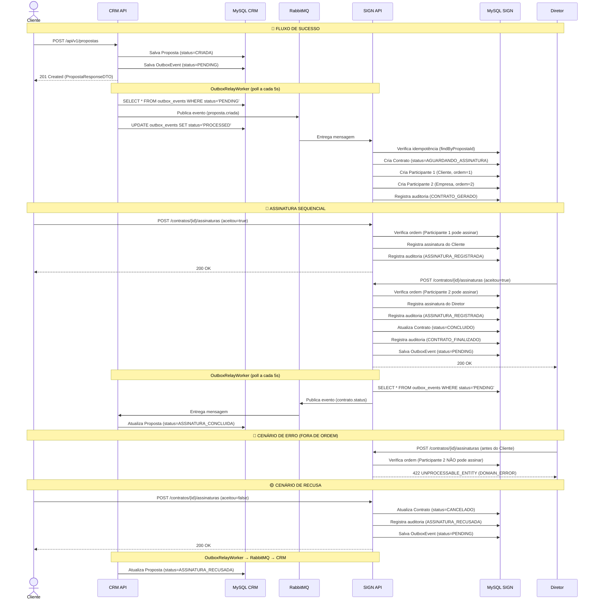
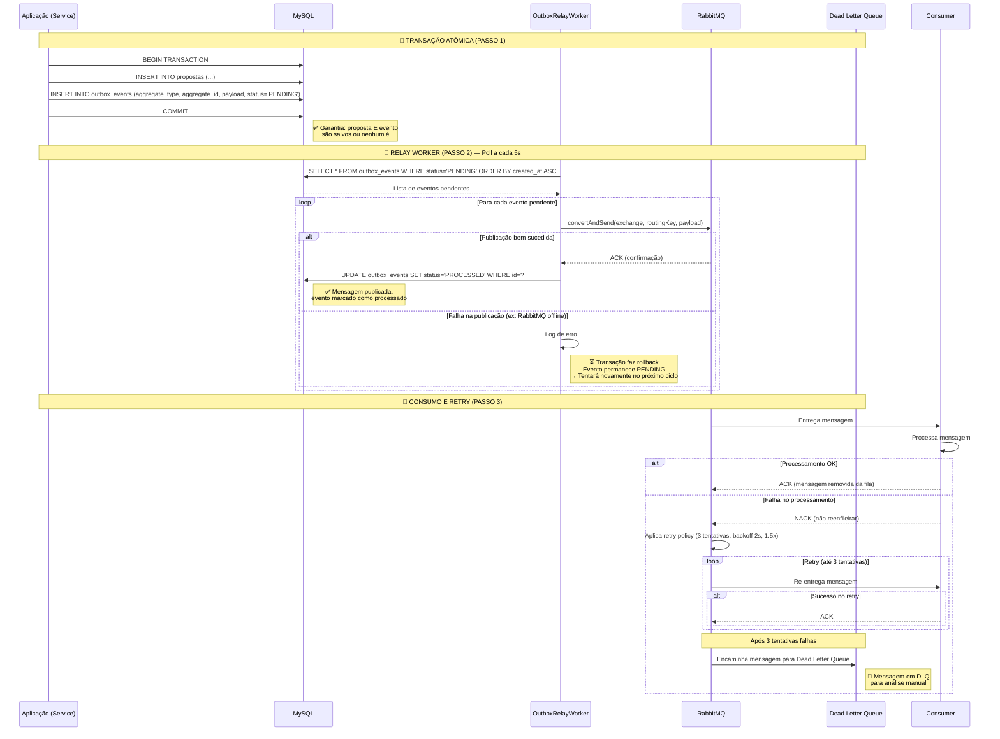
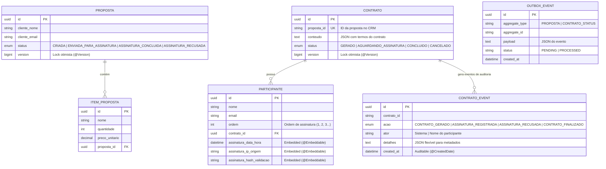

# Architecture Guide — Proposal Signature Platform

Documentação técnica aprofundada da arquitetura de microsserviços, decisões de design e topologia do sistema.

---

## Índice

1. [Estrutura de Diretórios (Clean Architecture)](#1-estrutura-de-diretórios-clean-architecture)
2. [Diagramas C4 e de Sequência](#2-diagramas-c4-e-de-sequência)
   - [2.1 Diagrama de Componentes (C4 Container Level)](#21-diagrama-de-componentes-c4-container-level)
   - [2.2 Diagrama de Sequência de Negócio](#22-diagrama-de-sequência-de-negócio)
   - [2.3 Diagrama de Sequência Técnico (Transactional Outbox)](#23-diagrama-de-sequência-técnico-transactional-outbox)
   - [2.4 Diagrama Entidade-Relacionamento (ERD)](#24-diagrama-entidade-relacionamento-erd)
3. [Defesas Técnicas](#3-defesas-técnicas)

---

## 1. Estrutura de Diretórios (Clean Architecture)

Abaixo está a estrutura de diretórios do microsserviço CRM (o SIGN segue o mesmo padrão). Cada camada tem responsabilidades rigidamente isoladas.

```
crm/src/main/java/com/powermobile/crm/
│
├── CrmApiApplication.java              # Ponto de entrada Spring Boot
│
├── adapters/                           # 🔌 FRAMEWORKS & DRIVERS
│   ├── inbound/
│   │   └── web/
│   │       ├── PropostaController.java     # REST endpoints
│   │       ├── dto/                         # Request/Response DTOs
│   │       │   ├── PropostaRequest.java
│   │       │   ├── PropostaResponseDTO.java
│   │       │   ├── ItemPropostaRequest.java
│   │       │   └── ItemResponseDTO.java
│   │       └── handler/
│   │           └── GlobalExceptionHandler.java  # Tratamento global de erros
│   │
│   └── outbound/
│       ├── persistence/
│       │   ├── OutboxRelayWorker.java         # Relay do Outbox → RabbitMQ
│       │   └── JpaPropostaRepository.java     # Implementação JPA (implícita)
│       ├── rabbitmq/
│       │   ├── RabbitMQConfig.java            # Filas, exchanges, DLQs
│       │   ├── ContratoStatusListener.java    # Consumidor de eventos do SIGN
│       │   └── DlqConsumer.java               # Consumidor Dead Letter Queue
│       └── config/
│           └── CacheConfig.java               # @EnableCaching
│
├── application/                         # 🎯 CASOS DE USO
│   └── port/
│       └── in/
│           └── CreatePropostaUseCase.java     # Interface de entrada (porta)
│
└── domain/                              # 🏛️ NÚCLEO DO NEGÓCIO
    ├── entity/
    │   ├── Proposta.java                    # Agregado raiz
    │   ├── ItemProposta.java                # Entidade filha
    │   └── OutboxEvent.java                 # Evento do Transactional Outbox
    ├── port/
    │   └── out/
    │       └── EventPublisher.java          # Porta de saída (DIP)
    ├── exception/
    │   ├── PropostaNotFoundException.java
    │   └── PropostaDomainException.java
    └── valueobject/
        └── PropostaStatus.java              # Enum → Value Object
```

### Papel de cada camada

| Camada | Responsabilidade | Depende de |
|---|---|---|
| **adapters/inbound** | Receber requisições HTTP, validar entrada, converter para DTOs, delegar para casos de uso | `application/port/in` |
| **adapters/outbound** | Implementar portas de saída (JPA, RabbitMQ, Redis). Conter toda a lógica de infraestrutura | `domain/port/out` |
| **application** | Orquestrar casos de uso. Não contém regras de negócio — apenas coordenação | `domain/port/out` |
| **domain** | Entidades, regras de negócio, value objects, exceções de domínio e portas (interfaces) | Nenhuma (camada mais interna) |

**Regra de Ouro:** O `domain` não importa nada de `infrastructure`, `adapters` ou `application`. A inversão de dependência é garantida porque as portas de saída (`EventPublisher`) são interfaces definidas no domínio e implementadas nos adapters.

---

## 2. Diagramas C4 e de Sequência

### 2.1 Diagrama de Componentes (C4 Container Level)



### 2.2 Diagrama de Sequência de Negócio



### 2.3 Diagrama de Sequência Técnico (Transactional Outbox)



### 2.4 Diagrama Entidade-Relacionamento (ERD)



---

## 3. Defesas Técnicas

### 3.1 Consistência em Falhas: Retry e Dead Letter Queue

**Problema:** Em sistemas distribuídos, mensagens podem falhar por razões transitórias (banco indisponível, timeout de rede) ou permanentes (payload inválido, bug no consumidor).

**Solução em camadas:**

| Camada | Mecanismo | Comportamento |
|---|---|---|
| **1. Retry com Backoff** | `spring.rabbitmq.listener.simple.retry` | 3 tentativas com intervalo inicial de 2s e multiplicador 1.5x. Erros transitórios são resolvidos automaticamente. |
| **2. Dead Letter Queue** | Filas DLQ configuradas no `RabbitMQConfig` | Após esgotar o retry, a mensagem é enviada para a DLQ. O `DlqConsumer` registra o payload em log para diagnóstico. |
| **3. Transactional Outbox** | Tabela `outbox_events` + `OutboxRelayWorker` | Garante que a mensagem só é publicada após o commit da transação. Se o RabbitMQ falhar, o evento permanece `PENDING` e é retentado no próximo ciclo de 5s. |

**Por que isso é superior a um simples try/catch?** O padrão Outbox garante **consistência eventual forte**: ou a transação inteira é commitada (proposta + evento) ou nada é salvo. Não há janela de inconsistência entre o banco e a fila.

### 3.2 DDD com Value Objects (@Embeddable)

**Problema:** Em modelos anêmicos, dados como `dataHora`, `ipOrigem` e `hashValidacao` da assinatura seriam colunas soltas na tabela `participantes`, sem encapsulamento ou invariantes.

**Solução:** `Assinatura` é um `@Embeddable` que agrupa esses 3 campos em um Value Object imutável:

```java
@Embeddable
@Data
@Builder
public class Assinatura {
    private LocalDateTime dataHora;
    private String ipOrigem;
    private String hashValidacao;
}
```

**Benefícios:**
- **Encapsulamento:** O `Participante` só expõe `registrarAssinatura(Assinatura)` — o caller não precisa saber quais campos compõem uma assinatura.
- **Imutabilidade:** Uma vez criada, a assinatura não pode ser alterada (sem setters públicos no Value Object).
- **Testabilidade:** `Assinatura.builder().dataHora(...).ipOrigem(...).build()` é fácil de construir em testes.
- **Achatamento no banco:** O JPA mapeia as 3 propriedades como colunas na tabela `participantes` (`assinatura_data_hora`, `assinatura_ip_origem`, `assinatura_hash_validacao`), sem necessidade de tabela extra.

### 3.3 Redis: Cache de Consultas e Idempotência

**Problema:** Os endpoints `GET /api/v1/propostas/{id}` e `GET /api/v1/contratos/{id}` são consultados repetidamente por participantes que verificam o contrato antes de assinar. Cada consulta ia ao MySQL sem necessidade.

**Solução — Cache de Consulta na Borda (Controller):**

O cache é aplicado nos Controllers, retornando DTOs serializáveis ao invés de Entidades JPA. Isso evita problemas de serialização do Hibernate (lazy loading, proxies) e mantém a camada de domínio isolada de preocupações de infraestrutura.

```java
@Cacheable(value = "propostas", key = "#id")
@ResponseStatus(HttpStatus.OK)
public PropostaResponseDTO buscarPorId(@PathVariable UUID id) {
    Proposta proposta = propostaService.buscarPorId(id);
    return PropostaResponseDTO.fromEntity(proposta);
}
```

> **Nota:** O cache armazena DTOs na borda (Controller) para evitar problemas de serialização de entidades JPA (como `LazyInitializationException` ou proxies do Hibernate) e proteger a camada de domínio de dependências de infraestrutura. Como os DTOs são POJOs simples, são perfeitamente serializáveis pelo Redis sem configuração adicional.

| Aspecto | Sem Redis | Com Redis |
|---|---|---|
| Latência (primeira chamada) | ~100ms (MySQL) | ~100ms (MySQL + populates cache) |
| Latência (chamadas subsequentes) | ~100ms (MySQL) | ~5ms (cache hit) |
| Carga no banco | N consultas por segundo | 1 consulta a cada TTL (5 min) |

**Potencial Futuro — Idempotência via Redis:**

Atualmente, a idempotência no `PropostaCriadaListener` é feita via banco (`findByPropostaId`). Para cenários de alto throughput, Redis oferece uma alternativa mais performática:

```
SET NX proposta:<propostaId> "processing" EX 60
```

Se retorna `OK` → primeira vez, processa. Se retorna `nil` → já processado, descarta. Isso reduz a carga no MySQL e oferece TTL automático para limpeza de chaves expiradas.

**Por que não usar Redis para tudo?** O cache é ideal para dados de consulta frequente com baixa taxa de atualização. Para dados transacionais (status de proposta/contrato), o MySQL continua sendo a fonte da verdade. O Redis é um acelerador, não um substituto.

---

## Resumo das Decisões Arquiteturais

| Decisão | Alternativa Rejeitada | Motivo |
|---|---|---|
| **Transactional Outbox** vs. Publicação direta no RabbitMQ | Publicação direta dentro da transação | Se o RabbitMQ falhar, a transação é perdida. O Outbox garante que nenhum evento seja perdido. |
| **DLQ + Retry** vs. Requeue infinito | Requeue infinito (default do Spring) | Mensagens inválidas entrariam em loop infinito, consumindo recursos. DLQ isola falhas para análise. |
| **@Embeddable (Value Object)** vs. Tabela separada para Assinatura | Tabela `assinaturas` com FK para `participantes` | Assinatura não é uma entidade — não tem identidade própria. Como Value Object, é achada na mesma tabela, sem JOIN. |
| **Redis para cache** vs. Redis para estado da sessão | Sessão em Redis | O projeto não tem autenticação. Cache de consulta é o uso mais natural e demonstrável. |
| **Micrometer Tracing** vs. OpenTelemetry Agent | OpenTelemetry Agent (instrumentação automática) | Micrometer é nativo do Spring Boot 4.x, mais simples de configurar e suficiente para tracing distribuído. |